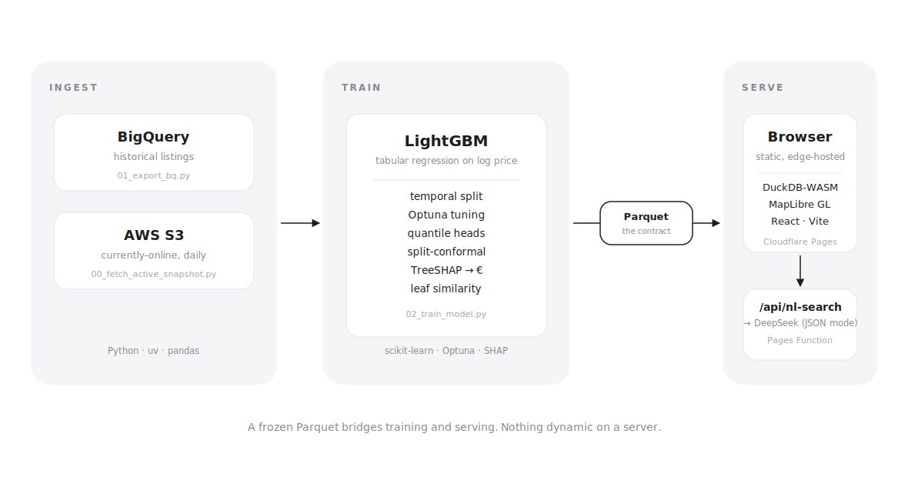

# Belgian Houses Fair Value

An interactive map of every home currently listed for sale in Belgium, where each property is color coded by how over- or under-priced it appears relative to a machine learning valuation model trained on historical Belgian real estate data. Click any listing for its model-estimated fair value, an 80% prediction band, the top SHAP drivers, and five comparable listings nearby.

**Live demo:** [belgian-house-fair-value.pages.dev](https://belgian-house-fair-value.pages.dev)

**Article explaining the methodology followed:** [`Belgian Houses Fair Value`](https://abdessettar.xyz/projects/spotify-gold-eda-new/).


---

## What the app does

The app shows ~10 000 currently online listings on a MapLibre map of Belgium. Priceable rows (those inside the model's training distribution) appear as coloured dots on a five stop diverging scale: green when strongly under-priced (< −40%), through teal, blue = fair (±20%), orange, to red when strongly over-priced (> +40%). Non-priceable listings (i.e., life annuities, new projects sales, transaction types the model wasn't trained on) sit underneath as smaller black dots, so the model's output stays the primary signal.

The sidebar carries filters (price, surface, bedrooms, days on market, postcode prefix, EPC, amenities), a "Top deals" panel with the 20 most-undervalued matches, and a free-text natural language box (e.g., "3 bedrooms near Ghent under 400k with a garden, EPC at least C") that translates into the same filter object via a small LLM proxy.
Click a dot and the detail panel opens on the right with the listed price vs the fair value, the calibrated 80% band, days on market (with a "stale" badge past 60 days), the top SHAP drivers (translated from log-price space into euros) and five model-native comparables that are themselves clickable. The map highlights the selected dot in indigo and its five comps in amber, dimming everything else to 20% opacity, and auto-fits the viewport to cover the lot so the user experience is smooth.

Filter state, the selected listing, the active language (EN/FR/NL), and the colour theme (light/dark) are all encoded into the URL and persisted to localStorage, so every view is deep-linkable.

---

## Architecture

<picture>
  <source media="(prefers-color-scheme: dark)" srcset="docs/architecture-dark.svg">
  
</picture>

---

## The model

### Framing

Supervised regression on `log1p(price)` as Belgian house prices are skewed/heavy-tailed, so multiplicative error is the meaningful loss. Predictions are `expm1`'ed back to euros for display and easier interpretation.

### Temporal split

A random 70/15/15 split would leak future listings into the training set and produce flattering metrics that don't survive production. Instead, the pipeline keeps the last 12 months, sorts by last modification datee of the classified, and slices 70/15/15 in that order. Test is the most recent 15% and is touched exactly once, at the end. The headline numbers therefore answer "how would today's model price tomorrow's listings".

### Feature set

About 50 features are used in total for this first iteration. Beyond the raw (numeric/binary/categorical) fields from the data stored in BigQuery, a few engineered features come strenghten the signal:

| feature | what | why |
|---|---|---|
| `dist_<city>` | Haversine distance to 7 major Belgian cities | captures the geographic price gradient cheaply |
| `commune_median_eur_per_m2` | postcode median of `price / surface` | strongest single signal; target-encoded out-of-fold to avoid leakage |
| `property_age`, `construction_decade` | derived from `constructionYear` | gives the trees a direct handle on era effects |
| `province` (first digit of postcode) | broader bucket | generalises to rare postcodes |

The postcode is treated as a categorical string, not an integer, on purpose: 4000 (Liège) and 4040 (Herstal) are numerically close but 90km from 1000 (Brussels), and a tree would treat the integer relationship as meaningful otherwise.

### Out-of-fold target encoding

`commune_median_eur_per_m2` is computed naïvely from the training set, but every row needs to be encoded from other rows. The training set is split into 5 random folds, each fold's encoding is computed from the other 4, so no row ever sees its own price. Validation and test use a single lookup computed from the full training set (val/test prices never enter it). Unseen postcodes fall back to the global median.

### Baselines, on the same temporal test slice

A model is only meaningful relative to what "no model" looks like.

| model | MAE | median APE | R² |
|---|---:|---:|---:|
| global mean | €256 538 | 42.2% | 0.00 |
| commune median €/m² × surface | €147 098 | 20.9% | 0.65 |
| Ridge on 8 numeric features (log target) | €134 757 | 17.8% | 0.53 |
| **LightGBM (tuned + calibrated)** | **€90 353** | **11.4%** | **0.82** |

LightGBM beats the strongest baseline by 33% on MAE and 6.4 percentage points on median APE.

### Hyperparameter tuning

Optuna TPE, 60 trials, `MedianPruner(n_warmup_steps=200)` killing the weak half of trials at round 200. Search covers learning rate, leaves, depth, leaf size, feature/bagging fractions, L1/L2, min gain to split. Objective: validation MAE on euro prices (not log). The final fit retrains on train+val at the chosen iteration count so "no data is wasted".

### Quantile heads for an honest range

A single point estimate misrepresents a model whose uncertainty varies wildly across listings (a standard 3 bed in Brussels is predictable, a one-off castle is not). Three boosters with the same hyperparameters and different objectives are trained:

- `quantile, alpha=0.025` → lower bound
- `quantile, alpha=0.50` → median, displayed as "fair value"
- `quantile, alpha=0.975` → upper bound

Two practical wrinkles: quantile loss converges slower than MSE (allow 5000 rounds, 150-round early stopping), and quantile crossing can occur (`q10 > q50` for some rows), fixed by a per-row `np.sort`.

### Split-conformal calibration

Nominal quantiles almost never match empirical coverage on unseen data. The pipeline trains wider than target quantiles (a nominal 95% band) on purpose, then computes a single additive `q_hat` from the validation set non-conformity scores so that `[q_low − q_hat, q_high + q_hat]` has guaranteed marginal coverage ≥ 80% on exchangeable new data. Because the raw bands over-cover validation, `q_hat` is often negative; the interval shrinks. On the held-out test set this lands at 79.5% empirical coverage, against an 80% target. The alternative (fitting 0.10/0.90 directly) gave 61% on test because validation residuals couldn't inform temporal drift: wider-and-shrink beats narrower-and-trust here.

### Explanations in euros

TreeSHAP (`pred_contrib=True`) runs natively in LightGBM and is ~100× faster than the `shap` package while producing identical numbers. Each contribution lives in log-price space, so the pipeline converts it to a euro impact at the point of generation:

```
delta_eur_i = expm1(pred_log) − expm1(pred_log − sv_i)
```

Stored as a JSON column (`shap_top`) in the Parquet and parsed lazily client-side. The sidebar reads "the 234 m² surface adds €25 100" instead of "+0.07 in log units".

### Similar listings

For each priceable row, the pipeline runs `pred_leaf=True` on the median model, counts how many of the ~1000 trees place each pair into the same leaf, and keeps the top-5 within the same sub-type and 50 km (maybe we should reduce this distance considering how small Belgium map is). This is a model-native similarity (i.e., two listings are "alike" if the pricing model treats them the same way) and is cheaper and more principled than a hand-tuned distance metric.


## The frontend

### Why DuckDB-WASM

With ~10k rows and tens of filters, the two options are: ship JSON and filter in the browser, or ship the Parquet and run SQL in a Web Worker. The Parquet + DuckDB-WASM path lets every filter change become a one-line `WHERE` clause running locally over the columnar file via HTTP range requests, with complexity living in SQL instead of React reducers. This is the single highest leverage architectural call in the project: it's why the whole site is a static deploy.

### NL search via DeepSeek

`web/functions/api/nl-search.ts` is a Cloudflare Pages Function that takes `{ text, lang? }`, calls DeepSeek in JSON mode with a system prompt describing the `Filters` TypeScript type and a small city→postcode dictionary (`Brussels=10, Ghent=9000, …`), and returns the parsed `Filters` to the frontend. Per query cost is fractions of a cent, and the DeepSeek key lives as a Cloudflare Pages secret and never reaches the browser. The function enforces an origin allow-list, a 500 character body cap, `max_tokens: 200`, and a generic 502 on upstream errors so DeepSeek payloads are never forwarded.

### Other things worth noting

- **EN/FR/NL UI with a homemade i18n layer:** three locale files, a strict `Locale` TypeScript shape so missing keys are a compile error, and locale-native narrative templates so the auto generated per listing summary reads natively in French and Dutch rather than as a translation.
- **Light/dark theme:** applied synchronously in `main.tsx` before React mounts to avoid a flash, swaps the MapLibre basemap (Carto Positron/Dark Matter) on the fly.
- **Deep-linkable everything**: filters, selected id, language, and tab serialise into the URL with `history.replaceState` (not `pushState`, so Back doesn't walk every keystroke).
- **The verdict** (Undervalued/Fairly priced/Overvalued) is based on whether the listed price falls inside the 80% band, not a fixed ±5% threshold, so a model with low confidence on a particular listing won't shout "overvalued" over a 6% delta.

---

## Stack and rationale

| layer | choice | why |
|---|---|---|
| Data Warehouse | BigQuery | High performance and the historical data lives here for years now  |
| Daily snapshot | AWS S3 | The scraper already drops JSON files here |
| ML | LightGBM | best-in-class on tabular data, native categorical handling, fast TreeSHAP |
| Tuning | Optuna (TPE + median pruner) | de-facto standard with a LightGBM pruner |
| Model persistence | LightGBM plain-text | no pickle, no Python-version lock-in |
| Web data format | Parquet (Zstd) | columnar, compressed, DuckDB-native |
| In-browser SQL | DuckDB-WASM | enables a zero-backend filter UI |
| Frontend | Vite + React + TypeScript | smallest modern React stack |
| Map | MapLibre GL + CARTO basemaps | OSS Mapbox fork; free tiles |
| Edge function | Cloudflare Pages Function | free tier, edge V8 isolates, one file |
| LLM | DeepSeek (`deepseek-chat`) | Chaep for structured-JSON parsing |
| Hosting | Cloudflare Pages | static + functions in one deploy, free tier |

---

## Daily refresh

A GitHub Actions workflow ([`.github/workflows/refresh.yml`](.github/workflows/refresh.yml)) runs nightly at 04:17 UTC (≈06:17 Belgium, after the upstream scrape). It re-pulls the S3 snapshot, re-exports the data from BigQuery, retrains and rescores the model, rebuilds the Vite bundle, and redeploys to Cloudflare Pages, all from a single (ubuntu) runner. `data/metrics.json` and `data/residuals_test.csv` are uploaded as run artefacts with 30 days retention so any regression can be inspected after the fact. The workflow is also triggerable on demand from the Actions tab.


## Repo layout

```
scripts/    data + ML pipeline
  00_fetch_active_snapshot.py    S3 → active_snapshot.parquet
  01_export_bq.py                BigQuery data → listings_raw.parquet
  02_train_model.py              baselines + Optuna + quantile heads + SHAP + conformal
  03_diagnose_coverage.py        slice the val/test coverage gap
  04_calibration_experiments.py  four conformal variants side by side
  05_conditional_conformal.py    per-segment conformal

notebooks/  EDA + post-training analysis
  01–05  classical, spatial, temporal, outliers, post-training (SHAP/PDP/residuals)

web/
  src/components/   MapView, Sidebar, DetailCard, AboutModel, theme/lang toggles
  src/lib/          DuckDB bootstrap, filter→SQL, URL state, NL search proxy
  src/i18n/         en.ts / fr.ts / nl.ts + Locale type
  functions/api/    Cloudflare Pages Function (DeepSeek proxy)
  public/           served static (parquet + metrics.json are gitignored)

data/      gitignored; produced by scripts
docs/      demo gif + screenshot
```

One limitation to note is that the parquet is served at a fixed URL, with default cache headers. This means that after a refresh, returning visitors see yesterday's data until a hard reload. A content-hashed URL would let caching be aggressive and invalidation precise.

## License

MIT.
